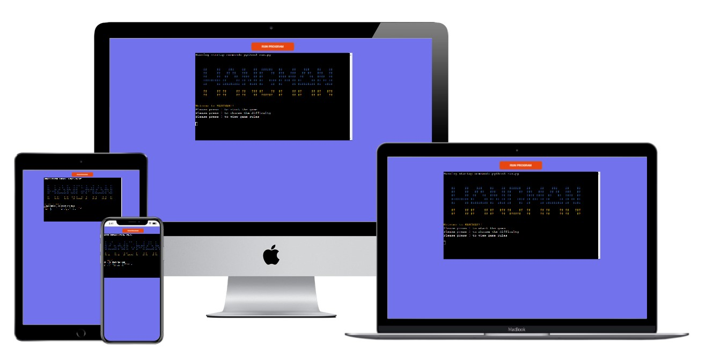

# Hangman

Hangeman is a very popular word guessing game, where a player gets limited number of guesses to guess the word.
Each time the player guesses a wrong letter, the hangman display grows. Eventually when all lives are lost the display shows a hanged man, hence the name.  

[Click here to play the game](https://hangman144.herokuapp.com/)  

  

## Table of Contents  

* [User Experience (UX)](#User-Experience-(UX))  
* [Design](#Design)  
* [Features](#Features)  
* [Technologies](#technologies)  
* [Testing](#Testing)  
* [Deployment](#Deployment)  
* [Acknowledgements & Credit](#Acknowledgements-&-Credit)   

## User Experience (UX)  

### User Story  

User stories were created to help guide the implementation phases of the project and to ensure the needs of each stake holder are undestood.  

* New Player Goals  
   * As a new player:  
     * I want to understand the rules and how to play the game.  
     * I want to be able to play the game easily. 

* Seasoned Player Goals  
   * As a player who has played this game before:  
     * I want to be able to directly start playing the game.  
     * I want to be able to choose the difficulty level.
     * I want to be able to play repeatedly.  

 
## Design

### Colour  

I have used the default background of the terminal which is black. To highlight certain text on the command line I have changed the text colour for easier readibility.  
 

### Font  

I have used the default font here. I have used ascii art to display the game logo and winner and looser graphics.  

## Features  

1. A player has multiple options to choose from.  
2. Immadiate game start, in the default mode which is level medium.  
3. 3 levels of difficulty to choose from.  
4. Simple explanation on the game in the rules section.  
5. Attractive graphics using ascii art.  

## Technologies  

### Languages used  

* Python

### Algorithm  

  

### Packages  

1. json - Used this package to read the data from json file where words are stored.  
2. random - Used this package to pick a random word from the dictionary of words.  

## Testing  

I have tested the code and the game logic by  

* Passing the python code through the PEP8 validator (http://pep8online.com/) and solving any errors and warnings.  
* Passing invalid and valid values while playing the game to check if the program responds as expected.  
* Tested the game in gitpod terminal as well as heroku terminal.  

## Deployment  

This game is deployed using Heroku app  

* One will need to create an account on [Heroku](https://www.heroku.com/)  
* Once signed in click on the "Create New App".  
* Enter a name for you app and select the appropriate region.  
* Click on create app.  
* Go to the "Settings" tab.
* Click "Add Buildpack".
* Add "nodejs" and then "python", the order is important here. Save  
* Go to the "Deploy" tab.
* Select the Github option and connect to github.  
* Search for the name of the github repository you want to connect to.  
* Click on Enable Automatic Deploy for automatic deploys or Deploy Branch to manually deploy.  
* Click "View" to view the deployed site.  
* The deployed site can also be accessed from the Environment section in the github repository.  

## Acknowledgements & Credit  

I have created the Ascii art using the website https://onlineasciitools.com/convert-text-to-ascii-art  
The words.json file is taken from https://stackoverflow.com/questions/594273/how-to-pick-a-random-english-word-from-a-list  
I have taken references and inspiration from a lot of tutorials and code available online https://www.codegrepper.com/code-examples/python/python+hangman ,  
https://morioh.com/p/6fc9584bb7d0 , https://itsourcecode.com/free-projects/python-projects/hangman-game-in-python-with-source-code/ 
Mockup generator https://techsini.com/multi-mockup/index.php for generating the mockup screenshot.  

